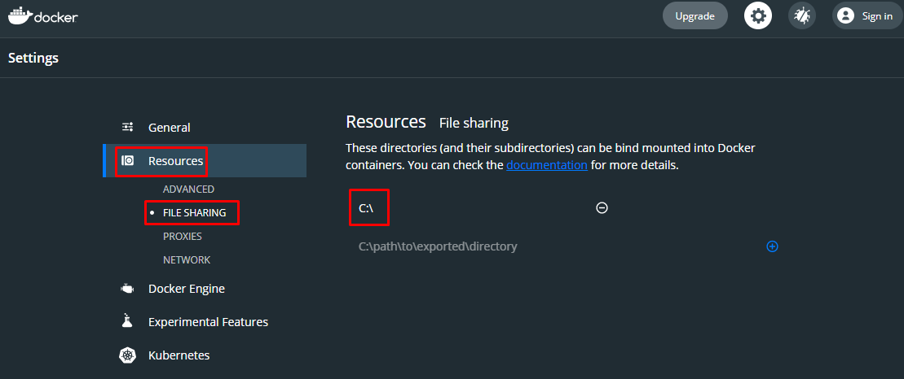

[](https://travis-ci.com/rbleggi/spring-boot)

```mermaid
flowchart LR        
        portainer
        mongo-express
        rabbitmq<-->api
        postgres[(postgres)]<-->api
        redis[(redis)]<-->api
        h2[(h2)]<-->keycloak
        api <--> keycloak
        api --> promtail
        api --> prometheus
        prometheus --> grafana 
        prometheus --> graylog
        subgraph Métricas 
            loki --> grafana 
            promtail --> loki
        end
        subgraph Logs 
            mongo[(mongo)] --> elasticsearch
            elasticsearch --> graylog
        end
    click rabbitmq "http://localhost:15672"
    click keycloak "http://localhost:8000"
    click grafana "http://localhost:3000"
    click prometheus "http://localhost:9090"
    click graylog "http://localhost:9000"
    click portainer "http://localhost:10000"
    click mongo-express "http://localhost:8081"
 ```

# API de Clientes
Um projeto de API de gerenciamento de clientes, desenvolvido em Java.

### Resumo
O presente material conta com os seguintes itens:
* Desenvolvimento de operações de gerenciamento de clientes (Cadastro, Edição, Busca e Remoção);
* Relação de cada uma das operações com o padrão arquitetural REST;
* Desenvolvimento de testes unitários para validação das funcionalidades;

Dentre as dependências temos as seguintes:
* Spring Boot
* Lombok
* Spring Web
* Spring Data JPA
* PostgreSQL
* MongoDB
* RabbitMQ
* Logback
* Actuator
* Mapstruct

# Instalação

### Requisitos

- Java 11 (altarar `JAVA_HOME`)
- Docker (`File sharing` habilitado)
  
- Docker Compose

### Docker

- `mvnw clean install package`
- `cd target`
- `docker-compose up`
- [Swagger](http://localhost:8090/api/client/swagger-ui/)
- [Prometheus](http://localhost:9090)
- [Grafana](http://localhost:3000)
- [Graylog](http://localhost:9000)
- [RabbitMQ](http://localhost:15672)
- [MongoDB](http://localhost:8081)

### Local

- `docker run -d -p 5432:5432 --name postgres -e POSTGRES_PASSWORD=123 postgres`
- `mvnw clean install spring-boot:run`

# Testes
- `mvnw verify`

# Configuração

- [Portainer](documentacao/portainer/README.md)
- [keycloak](documentacao/keycloak/README.md)
- [Grafana](documentacao/grafana/README.md)
- [Graylog](documentacao/graylog/README.md)