# Keycloak

## Configuração inicial

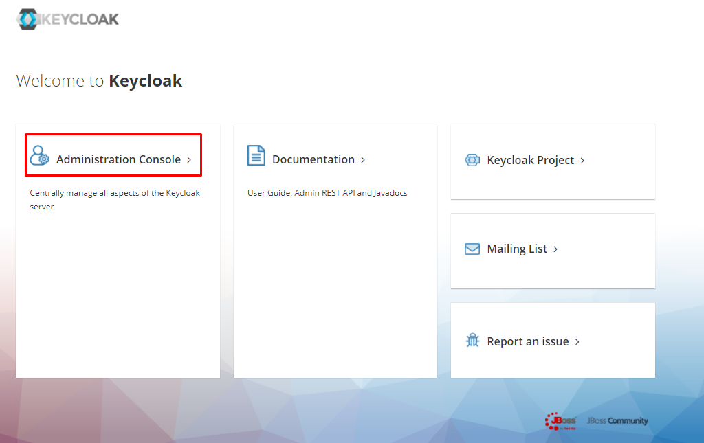

* user: `admin`
* senha: `admin`

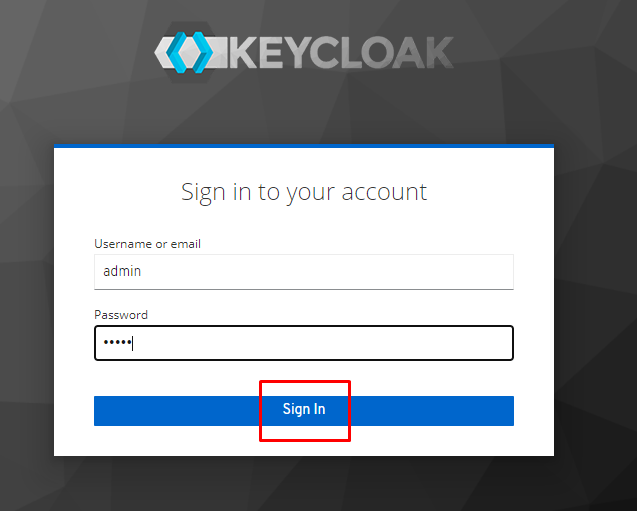
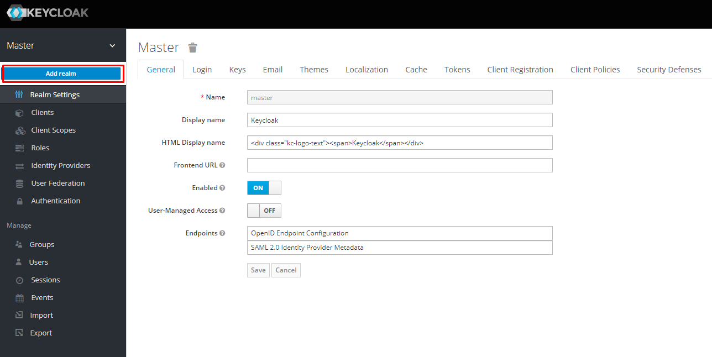
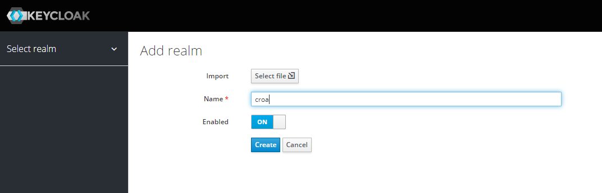
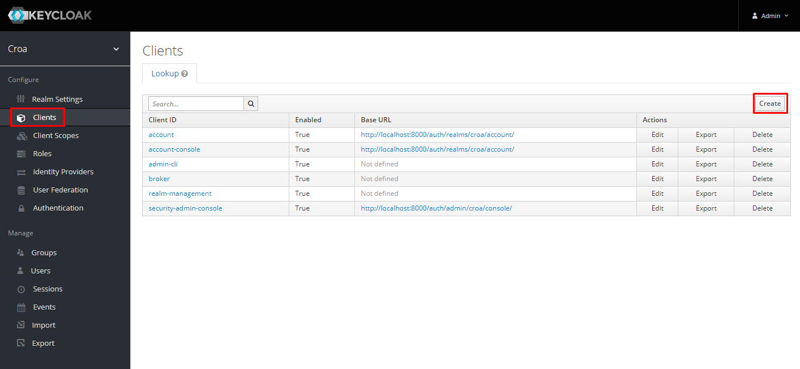
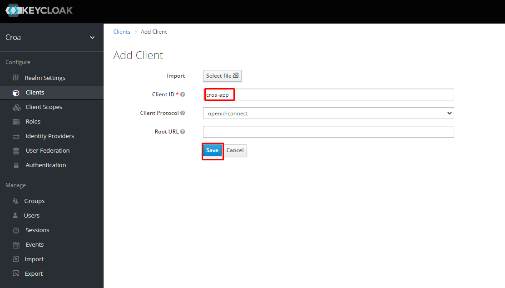
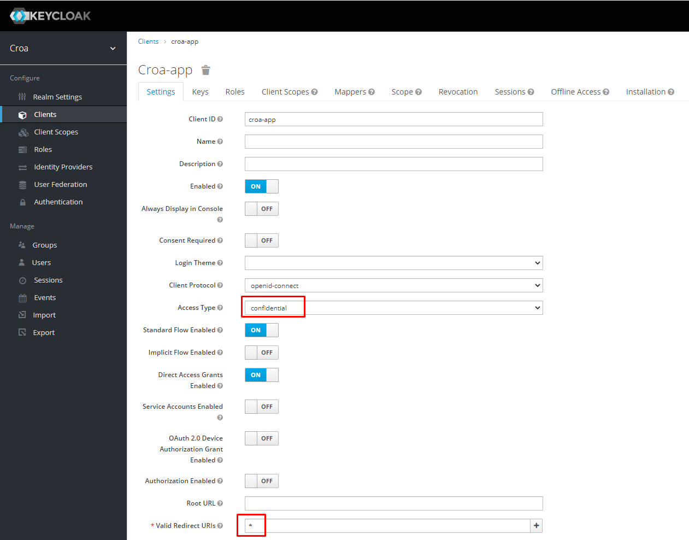

- copiar Secret e substituir no arquivo `application.yml`
- `spring.security.oauth2.client.registration.keycloak.client-secret`

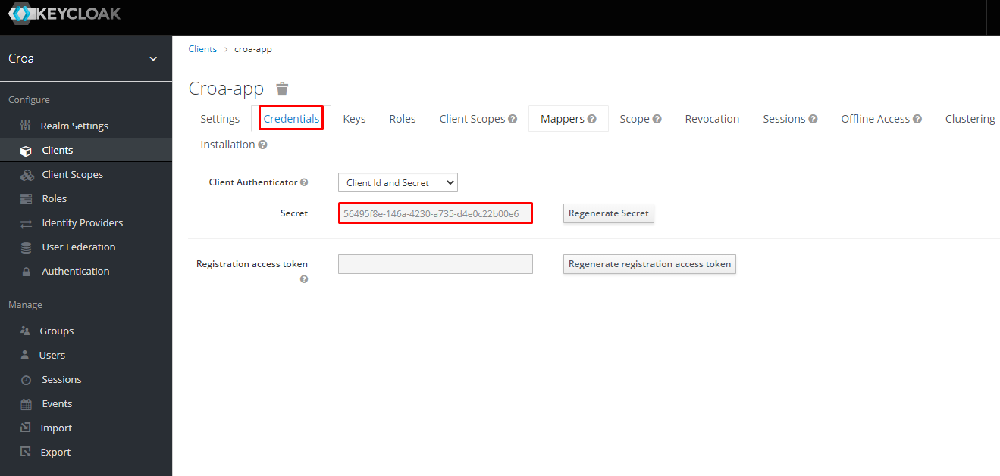
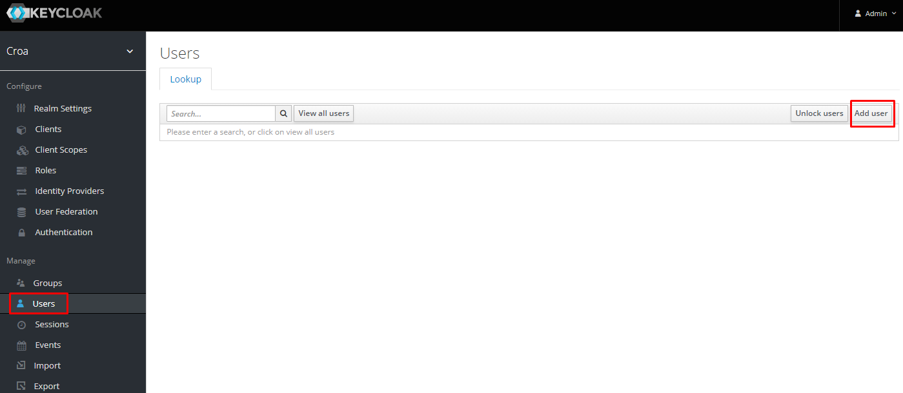
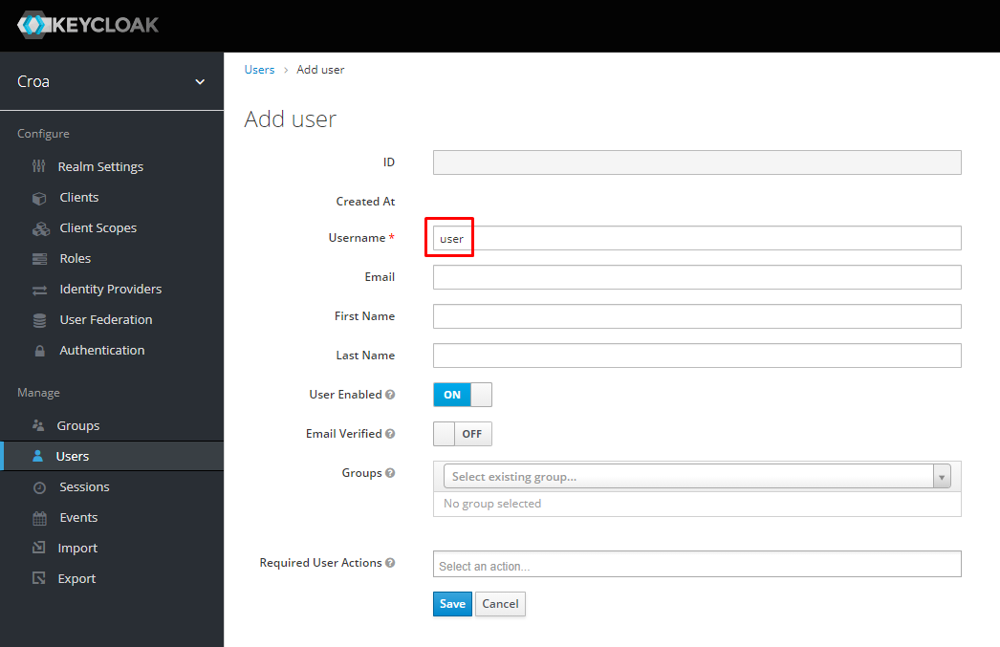
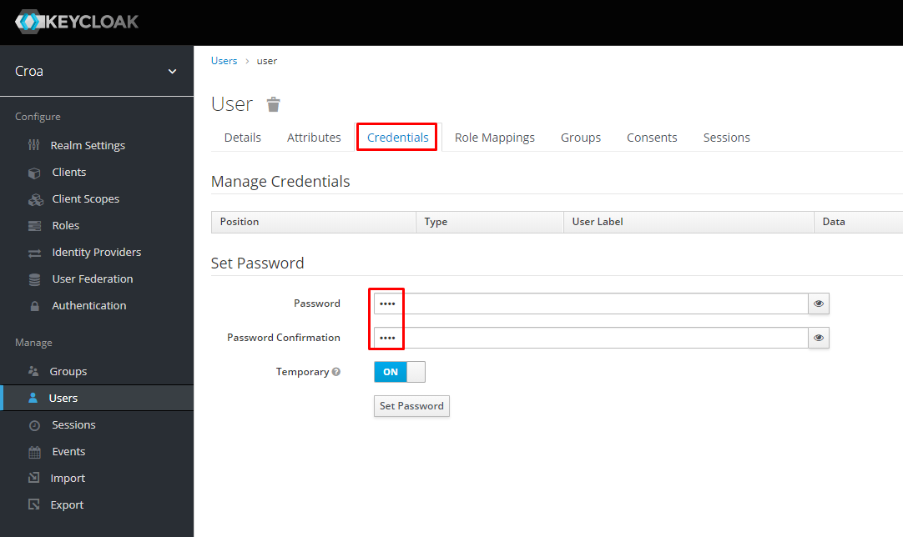